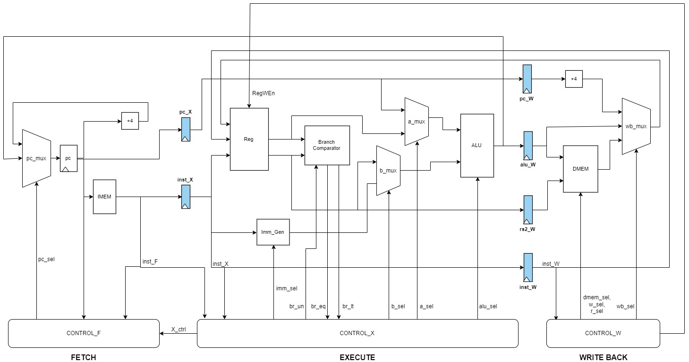

# Some notes
Practically, we have to wait for the posedge clock to write/read data memory. So, changing this to 4-stage will be a better choice

# Risc-V Single Cycle and 3-stage Pineline in Verilog
Computer Architecture Assignment

## Datapath Diagram

